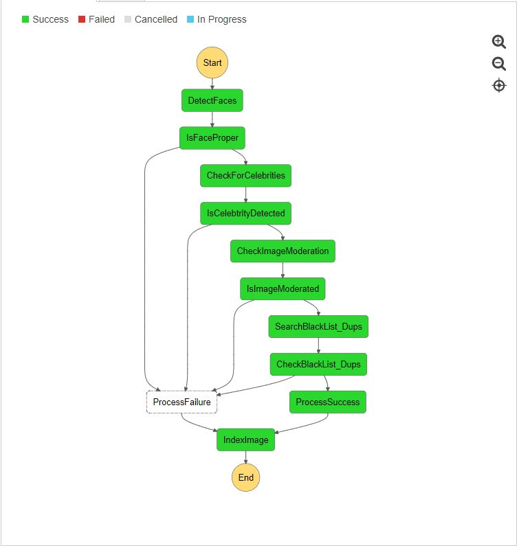
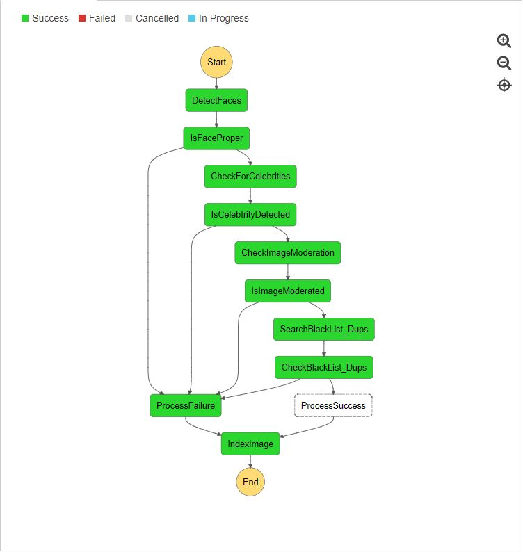

# Amazon Rekognition Policing User Content

A Stepfunctions driven workflow to use Amazon Rekognition to scan incoming images through a set of business rules and police apply policing, using AWS services like Amazon Rekognition, AWS Step Functions, Amazon DynamoDB and AWS Lambda. 

# Solution Architecture


Images can be captured by a camera (or a mobile device) and uploaded to S3. The image capture mechanism can be a website too. Once the image lands on the S3 bucket, the step functions flow can be triggered using a S3 event + Lambda (The S3 event triggering code is not included in this repository).
Step functions then executes a series of checks with Amazon Rekognition and builds a json template of its findings, as it progresses through the workflow. The process is successful if all the steps succeed and unsuccessful if any of them fails. The results are logged into Amazon Elasticsearch service and you use Kibana to visualize the results.

This repository contains the sample code for Lambda functions and Step functions as well as a SAM template to deploy the resources in an AWS region of your choice.

The following checks are implemented as a part of this workflow:
* Check for faces in the uploaded image. 
    * Fail if no face or more than one face detected.
    * Fail if mouth is detected as open, eyes detected as closed, face not looking in the right direction etc.
* Check for known celebrities
    * Fail if the uploaded image matches a known celebrity.
* Image moderation filter
    * Fail if image contains explicit nudity or suggestive content 
* Blacklist / duplicate check
    * Fail if the image is already uploaded by somebody else
    * Fail if the image matches a custom black list that you maintain

# Deployment 

## Instructions
This code depends on a bunch of libraries (not included in this distribution) which you will have to install yourself. We will be using AWS CLI as well.

1. Download the contents of this repository on your local machine (say: project-directory)
2. The solution is implemented in python, so make sure you can run python on your local machine.
3. Open a command prompt, navigate to the project directory and install the following libraries in the same directory (project-directory)
    1. ```pip install requests_aws4auth --target .```
    2. ```pip install elasticsearch --target .```
4. Create a S3 bucket for deployment (note: use the same region throughout the following steps, I have used us-east-2, you can replace it with the region of your choice. Refer to the [region table](https://aws.amazon.com/about-aws/global-infrastructure/regional-product-services/) for service availability.)
    1. ```aws s3 mb s3://rekdemo2017 --region us-west-2```
5. Package the contents and prepare deployment package using the following command
    1. ```aws cloudformation package --template-file Rek_Demo.yaml --output-template-file Rek_demo_output.yaml --s3-bucket rekdemo2017 --region us-west-2```
6. Deploy the package
    1. ```aws cloudformation deploy --template-file Rek_demo_output.yaml --stack-name RekDemoStack --capabilities CAPABILITY_IAM --region us-west-2```


## Outputs
Following are the outputs from the SAM template

1. **Elasticsearch Domain and Kibana endpoints:** You can use these endpoints to view the statistics about the uploaded images. Please note, you might have to modify the access policies for your ES instance, to allow access. Blog [here](https://aws.amazon.com/blogs/database/set-access-control-for-amazon-elasticsearch-service/).

# Code Walkthrough


## Step functions flow (success)



## Step functions flow (failure)



The lambda functions ProcessImage and ProcessFailure serve as hooks to do any custom processing that you might want to do.

## License

This library is licensed under the Apache 2.0 License. 
