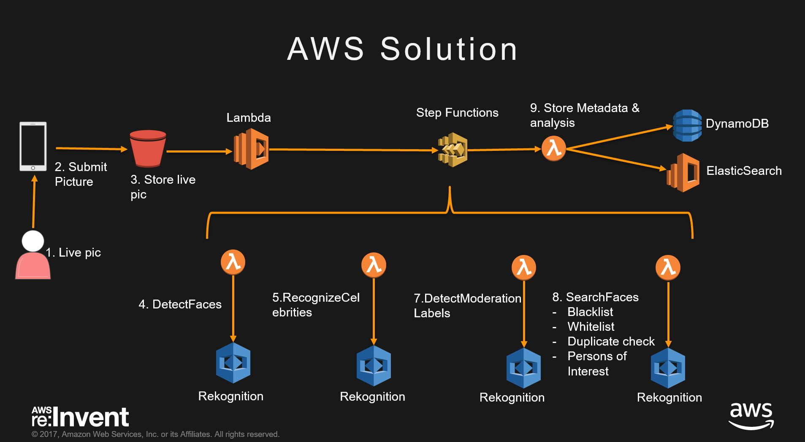

# Amazon Rekognition Reviewing User Content

A Stepfunctions driven workflow to use Amazon Rekognition to scan incoming images through a set of business rules and apply filtering, using AWS services like Amazon Rekognition, AWS Step Functions, Amazon DynamoDB and AWS Lambda. 

# Solution Architecture



Images can be captured by a camera (or a mobile device) and uploaded to S3. The image capture mechanism can be a website too. Once the image lands on the S3 bucket, the step functions flow can be triggered using a S3 event + Lambda (The S3 event triggering code is not included in this repository).
Step functions then executes a series of checks with Amazon Rekognition and builds a json template of its findings, as it progresses through the workflow. The process is successful if all the steps succeed and unsuccessful if any of them fails. The results are logged into Amazon Elasticsearch service and you use Kibana to visualize the results.

This repository contains the sample code for Lambda functions and Step functions as well as a SAM template to deploy the resources in an AWS region of your choice.

The following checks are implemented as a part of this workflow:
* Check for faces in the uploaded image. 
    * Fail if no face or more than one face detected.
    * Fail if mouth is detected as open, eyes detected as closed, face not looking in the right direction etc.
* Check for known celebrities
    * Fail if the uploaded image matches a known celebrity.
* Image moderation filter
    * Fail if image contains explicit nudity or suggestive content 
* Blacklist / duplicate check
    * Fail if the image is already uploaded by somebody else
    * Fail if the image matches a custom black list that you maintain

# Deployment and Execution

## Instructions
This code depends on a bunch of libraries (not included in this distribution) which you will have to install yourself. You will be needing [AWS CLI](http://docs.aws.amazon.com/cli/latest/userguide/installing.html) as well.

1. Download the contents of this repository on your local machine (say: project-directory)
2. The solution is implemented in python, so make sure you have a working python environment on your local machine.
3. Open a command prompt, navigate to the project directory. Navigate to the /code sub directory and install the following libraries: 
    1. ```bash
        pip install requests_aws4auth --target .
        ```
    2. ``` bash
        pip install elasticsearch --target .
        ```
4. Create a S3 bucket for deployment (note: use the same region throughout the following steps, I have used us-east-2, you can replace it with the region of your choice. Refer to the [region table](https://aws.amazon.com/about-aws/global-infrastructure/regional-product-services/) for service availability.)
    1. ```bash
        aws s3 mb s3://rekdemo2017 --region us-west-2
        ```
5. Prepare the SAM template: Open the Rek_Demo.yaml with your favorite editor and change the change the BucketName property of 'RekS3Bucket' to your choosing (say: S3Bucket). This is the bucket which will house the input images and the blacklist images to the StepFunctions state machine.

6. Package the contents and prepare deployment package using the following command
    1. ```bash
        aws cloudformation package --template-file Rek_Demo.yaml --output-template-file Rek_demo_output.yaml --s3-bucket rekdemo2017 --region us-west-2
        ```
7. Deploy the package
    1. ```bash 
        aws cloudformation deploy --template-file Rek_demo_output.yaml --stack-name RekDemoStack --capabilities CAPABILITY_IAM --region us-west-2
        ```
8. If you want to make changes to the Lambda functions, you can do so on your local machine and redeploy them using the steps 6 and 7 above. The package and deploy commands take care of zipping up the new Lambda files(along with the dependencies) and uploading them to AWS for execution.


## Outputs
Following are the outputs from the SAM template

1. **Elasticsearch Domain and Kibana endpoints:** You can use these endpoints to view the statistics about the uploaded images. Please note, you might have to modify the access policies for your ES instance, to allow access. Blog [here](https://aws.amazon.com/blogs/database/set-access-control-for-amazon-elasticsearch-service/).

## Execution
 The StepfunctionInput.json file contains sample invocations that you can use to trigger the worklow. The Step Functions state machine expects input to be passed in a particular format. You can change the values, but the structure is expected by the lambda functions that are triggered by the state function.

 1. Upload Images: 
    1. Upload the images from the **project-directory**/images/test/ folder to **S3Bucket**/reInvent2017/RekognitionDemo/InputImages/.
    2. Upload the images from the **project-directory**/images/blackList/ folder to **S3Bucket**/reInvent2017/RekognitionDemo/BlacklistImages/.
 2. Navigate to your Step Functions console, choose the state machine that was deployed.
 3. Click on 'New Execution'.
 4. In the input window, you can paste any of the sample inputs from StepfunctionInput.json, or point to your own image file.
 5. Click on 'Start Execution'.


# Code Walkthrough

## Step functions flow (success)


For a successful iteration, you can expect all the states successfully executed. Below is the sample input to the 'ProcessSuccess' state. You can expect this input to the lambda function associated with this state and apply your custom processing logic in this lambda function.

```json
{
  "Params": {
    "Bucket": "mayankdemo1-us-west-2",
    "Key": "reInvent2017/RekognitionDemo/InputImages/person1.jpg"
  },
  "OverallResult": {
    "Reason": "",
    "Details": [
      {
        "Pass": true,
        "ErrorMessages": [
          "Gender of Face = Female"
        ],
        "Stage": "DetectFaces"
      },
      {
        "ErrorMessages": [],
        "Stage": "RecognizeCelebrities",
        "Pass": true
      },
      {
        "Pass": true,
        "ErrorMessages": [],
        "Stage": "DetectModerationLabels"
      },
      {
        "ErrorMessages": [],
        "Stage": "CheckBlackList_Dups",
        "Pass": true
      },
      {
        "ErrorMessages": [
          "Image added to collection."
        ],
        "Pass": true,
        "Stage": "ProcessImage"
      }
    ],
    "Pass": true
  }
}
```

## Step functions flow (failure)


For a failed iteration, you can expect only some of the states successfully executed. Below is the sample input to the 'ProcessFailure' state, when a duplicate is detected. You can expect this input to the lambda function associated with this state and apply your custom processing logic in this lambda function.

```json
{
  "Params": {
    "Bucket": "mayankdemo1-us-west-2",
    "Key": "reInvent2017/RekognitionDemo/InputImages/person1.jpg"
  },
  "OverallResult": {
    "Reason": "BLACKLIST_DUPS_DETECTED",
    "Details": [
      {
        "ErrorMessages": [
          "Gender of Face = Female"
        ],
        "Stage": "DetectFaces",
        "Pass": true
      },
      {
        "Pass": true,
        "ErrorMessages": [],
        "Stage": "RecognizeCelebrities"
      },
      {
        "ErrorMessages": [],
        "Stage": "DetectModerationLabels",
        "Pass": true
      },
      {
        "ErrorMessages": [
          "Duplicate Image Detected."
        ],
        "Pass": false,
        "Stage": "CheckBlackList_Dups"
      }
    ],
    "Pass": false
  }
}
```

## License

This library is licensed under the Apache 2.0 License. 
